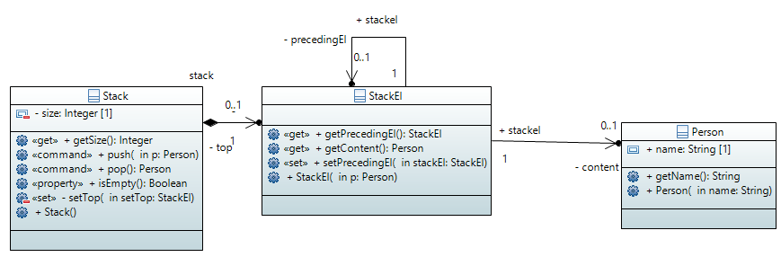

# UML2PROV User guide for Java
## Introduction

This document is intended as a guide for the Java reference implementation of UML2PROV. It focuses on explaining the steps to follow to transform a Java application into a provenance-aware application, that is the same application with provenance generation capabilities. It also serve as a quick guide for developers who are interested in using UML2PROV applying their own configuration for managing and storing provenance data collected after applying UML2PROV.

Readers are assumed to know the W3C PROV standard ([https://www.w3.org/TR/prov-overview/](https://www.w3.org/TR/prov-overview/)) for the representation of provenance, especially the PROV-Templates approach ([https://provenance.ecs.soton.ac.uk/prov-template/](https://provenance.ecs.soton.ac.uk/prov-template/)).

UML2PROV leverages Aspect Oriented Programming (AOP) to instrument the original application, concretely an AOP extension to the Java programming language called AspectJ ([https://www.eclipse.org/aspectj/](https://www.eclipse.org/aspectj/)). Having AspectJ installed is a requirement for using this Java UML2PROV reference implementation (see below for installation instructions).

## What is UML2PROV?

UML2PROV is a framework aiming at providing any application with the ability to generate provenance information (i.e., to make _provenance-aware_ applications). UML2PROV relies on the application's UML design for creating those artefacts needed to generate provenance. This way, UML2PROV bridges the gap between application design and provenance design, minimising software engineers intervention and without requiring them to have provenance skills.

Designers can follow their preferred software engineering methodology in order to create the UML diagrams representing an application's design, and then, UML2PROV comes into play to automatically generate:

1. A set of _PROV-templates_ expressing the design of the provenance to be generated. PROV-templates describe the provenance graph specifying some variables acting as placeholder for values that have to be captured while the application is executing.
2. A Java software module, called _Bindings Generation Module_ (BGM), for collecting values of interest as application is running (encoded as variable-value associations called bindings). This BGM can be deployed in the application with a minimal developers intervention.

The combination of the PROV-templates with the bindings providing values for the templates' variables generates provenance (PROV Documents) ready to be exploited.

## How to get UML2PROV

This UML2PROV reference implementation is a java project available on GitHub ([https://github.com/uml2prov/uml2prov.git](https://github.com/uml2prov/uml2prov.git)). Alternatively, users can download the zip archive available at [http://uml2prov.unirioja.es/uml2prov_release_0.2v.zip](http://uml2prov.unirioja.es/uml2prov_release_0.2v.zip) with the code already compiled and containing a binary executable and a simple example. This archive includes:

1. _uml2prov.jar_:  the executable UML2PROV tool. Dependencies for this executable must be located in a subdirectory named *uml2prov_lib*
2. *uml2prov_lib*: directory with uml2pov.jar dependencies (this directory must be in the same folder as uml2pov.jar).
3. _model.profile.uml_: UML profile used to stereotype UML operations in the UML class diagram.
4. _examples_: directory with examples, containing three subdirectories:
	- _apps_: directory with the source code of an example application.
	- _models_: directory with UML models describing the example application.
	- _listeners_: directory with java implementations of the `BGMEventListener` java interface used in this guide.

## How to use UML2PROV

Follow the next steps to make an application provenance-aware using the UML2PROV framework.

### Before using UML2PROV

UML2PROV assumes that UML diagrams are available for the application. UML2PROV supports Sequence diagrams, State Machine Diagrams, and Class diagrams.

UML2PROV requires the UML diagrams to be serialized in XMI, a standard exchange format, or UML, an Eclipse-specific XMI serialization, which are supported by most tools for designing UML diagrams.

#### Example

Consider the UML design of a system that manages the addition and removal of a _Person_ in/from a _Stack_ (example taken from the _Stack example_ presented in M. Seidl et al, _UML@Classroom_, Springer, 2012). A Person object can be placed on a Stack objectusing the pushfunction, and can be removed from the stackusing the pop function.

This UML design consists of one Class diagram, two Sequence diagrams, and one State Machine diagram. Below, we can see how these UML diagrams look like. Since the scope of this document is not to explain UML, we refer readers not familiar with this language to the standardized documentation of UML (OMG. Unified Modeling Language, UML. Version 2.5. March, 2015). They have been developed using Papyrus ([https://www.eclipse.org/papyrus/](https://www.eclipse.org/papyrus/)). The Papyrus project containing the diagrams can be found in [http://uml2prov.unirioja.es/stack_papyrusProject.zip](http://uml2prov.unirioja.es/stack_papyrusProject.zip).

##### UML Class diagram

##### UML Sequence diagrams


##### UML State Machine diagram of class StackEl


The UML diagrams are serialized in UML format inside the _Stack.uml_ file, which is downloaded together with the uml2prov distribution (examples/models/Stack.uml)_._

### Obtain the provenance design and the BGM

Having the application UML diagrams, UML2PROV comes into play taking them as input and automatically generating both the design of the provenance expressed as PROV-templates, and the BGM for collecting provenance. This BGM is ultimately responsible for capturing the provenance data as variable-value associations (bindings) while the application is running.

Note that the BGM is developed on top of AspectJ (an AOP extension to the Java programming language). Thus, no manual intervention is required for the instrumentation of the target application, and the resulting application automatically collects the source data transparently for software developers.

To obtain these UML2PROV artefacts, execute the following command:
```sh
java -jar uml2prov.jar -m <path_to_UML_diagrams> -i <path_to_BGMEventListener_directory> -l <Fully-qualified name_of_BGMEventListener>
```
This executable requires three mandatory arguments:

`-m` | Path to the UML diagrams serialized in XMI or ULML.

`-i` | Path to the directory containing the listener source class (a java file inside its packages directories). This class has to implement the `BGMEventListener` interface. This class specifies how to manage the bindings collected during the execution of the application (see in Appendix A how to implement a class for managing bindings).

`-l` | Fully-qualified name of the listener class.

Optionally, the output directory, may be specified using option `-o`:

`-o` | Path to the output directory (by default, this directory is `./src-gen`).

#### Example:
```sh
java -jar uml2prov.jar -m examples/models/Stack.uml -i examples/listeners -l a.b.ListenerCSV
```

The execution of the command generates a new directory (called `./src-gen`), with the following content:

- `templates`: folder containing the PROV-templates.
- _Java package_ `es.unirioja.uml2prov.bgm`: this package contains the source code generated to collect bindings: UML2PROV API Java Classes and an AspectJ _aspect_ with helper classes. 
- A copy of the Java package containing the provided listener 
- `dependencies`: folder with dependencies necessary to run the aspect.

### Integrate the BGM into the existing application

Once the BGM has been generated, it must be integrated into the target application. As the BGM is developed on top of AspectJ, this must be installed before proceeding with this second step.

#### AspectJ installation instructions 

(See [https://www.eclipse.org/aspectj/](https://www.eclipse.org/aspectj/) for more details on installing AspectJ) 

1. Download the latest release of AspectJ from[https://www.eclipse.org/aspectj/downloads.php](https://www.eclipse.org/aspectj/downloads.php) 
2. The .jar files should not be unzipped as they are self-extracting Java-based GUI installers.  On many systems they can be run directly by selecting "Open this file from its current location" or by double-clicking the downloaded file. 
3. When the automatic installation process is completed, we recommend: 
	1. Add `<installation_folder>/lib/aspectjrt.jar` to your CLASSPATH. This jar contains classes required by any program compiled with the _ajc_ compiler. 
	2. Modify your PATH system variable to include `<installation_folder>/bin`. This will make it easier to run _ajc_. 

#### Use AspectJ to instrument the application

Thanks to AspectJ, the instrumentation of the target application is done by means of the _AspectJ weaver_. This component automatically integrates (weaves) the behaviour for capturing provenance (specified in the previously generated _aspect_) into the target application's source code, avoiding the manual code adaptation.

The AspectJ compiler (called ajc) enables the weaving during the build process before deploying the application. It can take input in the form of source files, class files, and jar files. The compiler produces woven bytecode (class or jar files) that can be deployed in any standard compliant VM. Below, we show how to proceed in two different scenarios: first, when the source code of the target application is available, and second, when the target application has been compiled in a jar file.

**NOTE:** UML2PROV requires a Java 1.8 (or higher) version

#### Scenario 1: source code weaving

Specify in the `-sourceroots` option of the ajc compiler the list of paths to directories containing the source files to be compiled (the application source code and the code of the BGM generated in the previous step using uml2prov.jar). (NOTE: ajc requires that if there is more than one directory in the path list, this must be enclosed in double quotes). 

Then, ajc compiles all source files under each specified directory and its subdirectories. Our recommendation is compiling the generated code (within the _output_ directory generated in the previous step) inside a jar file. To do it, specify in the `-outjar` option the name of the final instrumented application jar.

**Example**:
Assuming a Windows system, the following command compiles all the source files under the examples/apps/StackExample/src and ./src-gen directories; then, it generates a jar with the code instrumented (called StackAppWithPROV.jar).

```sh
ajc -1.8 -sourceroots "examples/apps/StackExample/src;src-gen" -outjar StackAppWithPROV.jar
```
The executable StackAppWithPROV.jar will execute the original behaviour of the application together with the behaviour for collecting bindings.

#### Scenario 2: binary weaving

Often, the application source code is not available, for example, when third-party libraries are used. If this is your case, the procedure is slightly different. Two steps are required.

First, use the `-sourceroots` option to pass to the ajc compiler the directories containing the source files of the generated BGM (generated in the previous step using uml2prov.jar) (NOTE: ajc requires that if there is more than one directory in the path list, this must be enclosed in double quotes). You must also use `–outjar` option to set the output jar in which the compiled code together with the dependencies.

**Example**:
Assuming a Windows system, the following command compiles all the generated aspects and classes resulting from the uml2prov.jar execution (previous step), and generates a jar with the instrumentation code (called BGM.jar).

**WARNING**: the process will display a number of warnings because, at this point, we don't provide to the ajc compiler the code of the classes to be instrumented. They will be provided in the next step.

```sh
ajc -1.8 -sourceroots src-gen -outjar BGM.jar
```

Second, the target application (Stack.jar) must be weaved with the behaviour compiled in the BGM.jar, generating a new executable called StackAppWithPROV2.jar.

Example: 
```sh
ajc -inpath examples/apps/StackExample/Stack.jar -aspectpath BGM.jar -outjar StackAppWithPROV2.jar
```

The new executable StackAppWithPROV2.jar will execute the original behaviour of the application together with the behaviour for collecting bindings.

### Execute the application with provenance capabilities

In the first scenario, where all the code has been compiled together, the application with provenance capabilities is executed as follows (Note that `App.App` is the name of the main class of the application taken as example; it just creates 10 `Person` objects and adds then to an `Stack` object):

```sh
java -cp StackAppWithPROV.jar;src-gen/dependencies/* App.App
```

Conversely, if we proceeded with the latter scenario, and we performed a binary weaving, we can execute the application with provenance capabilities as follow:

```sh
java -cp StackAppWithPROV2.jar;src-gen/dependencies/*;BGM.jar App.App
```


# Appendix A

## How to configure the management of bindings

The configuration for managing bindings boils down to develop a java class implementing the interface `es.unirioja.uml2prov.bgm.BGMEventListener`.

### BGMEventListener interface

The implementation of this interface defines how the bindings will be managed, in addition to the persistence system used to store them. Such an implementation is under the responsibility of the developer, who knows the desirable characteristics of her/his system and the software requirements.

```java
package es.unirioja.uml2prov.bgm;

public interface BGMEventListener {
	public void newValueBinding(BGMEvent e);
	public void newBinding(BGMEvent e);
	public void operationStart(BGMEvent e);
	public void operationEnd(BGMEvent e);
}
```

| Method | Description |
| --- | --- |
| `void operationStart(BGMEvent e)` | Manages information about the start of an operation execution. |
| `void operationEnd(BGMEvent e)` | Manages information about the end of an operation execution. |
| `void newBinding(BGMEvent e)` | Manages information about the collection of a provenance value associated with a _group variable_, i.e., a type of variable that occurs in a mandatory identifier position (*) |
| `void newValueBinding(BGMEvent e)` | Manages information about the collection of a provenance value associated with a _statement-level variable_, i.e., a type of variable that occurs in an optional identifier position, or in an attribute-value pair (*) |

(*) Danius Michaelides, Trung Dong Huynh, and Luc Moreau. PROV-TEMPLATE: A Template System for PROV Documents, 2014. Available at [https://provenance.ecs.soton.ac.uk/prov-template](https://provenance.ecs.soton.ac.uk/prov-template). Last visited on October 2019.

### BGMEvent class

Each method in `es.unirioja.uml2prov.bgm.BGMEventListener` receives a `es.unirioja.uml2prov.bgm.BGMEvent` object as an input parameter. Class `BGMEvent` represents the occurrence of an _event_ during the execution of an operation in the context of a certain execution of the application (execution identified with a certain execution id), and it carries information about it. Such information is the data provenance to be managed.

| Method | Description |
| --- | --- |
| `String getExecutionID()` | Returns a `String` containing a unique identifier of the application execution. |
| `String getClassName()` | Returns a `String` with the name of the class to which the traced operation belongs.   |
| `String getExecutionIDMethod()` | Returns a `String` containing a unique identifier of the execution of the traced operation. |
| `String getVarName()` | Returns a `String` containing the name of the PROV-template variable whose value has been collected. |
| `String getValue()` | Returns a `String` containing the collected value for the PROV-template variable previously mentioned. |
| `String getState()` | (if any) Returns a `String` containing the object's state reached before/after the execution of the operation. |

### Example of a class implementing the BGMEventListener interface

For illustrative purposes only, below we depict a very basic implementation of the `BGMEventListener` interface, which creates one csv file including the bindings of each operation that has been executed.  This CSV file has the following header:

| UUID app execution | UUID operation execution | Class name | Variable | Value |
| --- | --- | --- | --- | --- |

Below the class code:

```java
package a.b;

import java.io.FileNotFoundException;
import java.io.PrintStream;
import java.util.Random;
import es.unirioja.uml2prov.bgm.BGMEvent;
import es.unirioja.uml2prov.bgm.BGMEventListener;

public class ListenerCSV implements BGMEventListener {

  private PrintStream ps;

  public ListenerCSV() {
    try {
      String firstLine = "UUID app execution, UUID operation execution, Class name, Variable, Value";
      String nameFile = Math._abs_(new Random().nextInt()) + "_bindings.csv";
      ps = new PrintStream(nameFile);
      ps.println(firstLine);
    } catch (FileNotFoundException e) {
      e.printStackTrace();
    }
  }

  private String newLine(BGMEvent e) {
    StringBuffer s = new StringBuffer();
    s.append(e.getExecutionID()).append(",");
    s.append(e.getExecutionIdMethod()).append(",");
    s.append(e.getClassName()).append(",");
    s.append(e.getVarName()).append(",");
    s.append(e.getValue());
    return s.toString();
  }

  @Override
  public void newValueBinding(BGMEvent e) {
    ps.println(newLine(e));
  }

  @Override
  public void newBinding(BGMEvent e) {
    ps.println(newLine(e));
  }

  @Override
  public void operationStart(BGMEvent e) {
  }

  @Override
  public void operationEnd(BGMEvent e) {
  }
}
```
